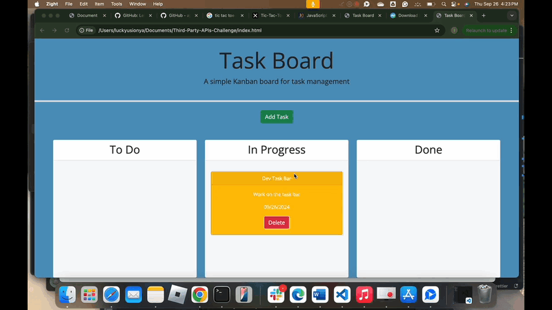

## Third-Party-APIs-Challenge

Module 5 Challenge

## Third-Party APIs Challenge: Task Board

## Table of Contents

- Description
- Technologies
- Installation
- Usage
- Screenshot
- Contact
- Reference
- License

## Description

This project challenges you to create a simple task board application using starter code and dynamic updates with jQuery, and HTML/CSS. It's designed to help teams effectively manage project tasks.

## Technologies

- HTML
- CSS
- JavaScript
- jQuery
- Day.js

## Installation

    1. Download ZIP file or clone repository to your local machine using the link below:
        - Github: [https://github.com/keno213/Third-Party-APIs-Challenge]
        (https://github.com/keno213/Third-Party-APIs-Challenge)

          - Github.io: [https://keno213.github.io/Third-Party-APIs-Challenge] // to view the full functionality
          (https://keno213.github.io/Third-Party-APIs-Challenge)

    2. Using your code editor, open the `index.html` file in your preferred web browser.

## Usage

- Open the application in a web browser.
  - A list of project tasks is displayed in columns representing the task progress state (To Do, In Progress, Done).
- Add tasks using the "Add Task" button.
  - A dialgue should pop-up, enter the task title, task due date and task description for the new task into a modal dialog then click "Add Task".
- Drag tasks between columns to update their progress state.
  - The task's progress state is updated accordingly and will stay in the new column after refreshing.
- Delete any tasks using the delete button.
  - When I refresh the page, the deleted task should be removed

## Screenshot

- 

## Contact:

Feel free to reach out to Lucky Usionya through the contact information provided on the website or through his social media profiles if you have any questions or feedback.

## References:

- UT Austin Bootcamp - UTA-VIRT-FSF-PT-02-2024-U-LOLC
- Bootstrap:
  - https://getbootstrap.com/docs/4.0/components/modal/
- W3School:
  - https://www.w3schools.com/howto/howto_js_draggable.asp
- Stack Overflow:
  - https://stackoverflow.com/questions/72797926/how-to-add-tasks-to-do-list-using-javascript
- jQuery:
  - https://jqueryui.com/draggable/
- jQuery UI:
  - https://jqueryui.com/
- Day.js:
  - https://day.js.org/
- How to create a simple to-do list with HTML, CSS, and JS
  - https://www.educative.io/answers/how-to-create-a-simple-to-do-list-with-html-css-and-js
- HTMLElement: drop event
  - https://developer.mozilla.org/en-US/docs/Web/API/HTMLElement/drop_event

## License

- MIT License
